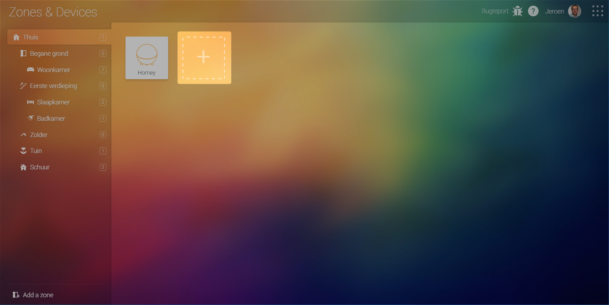
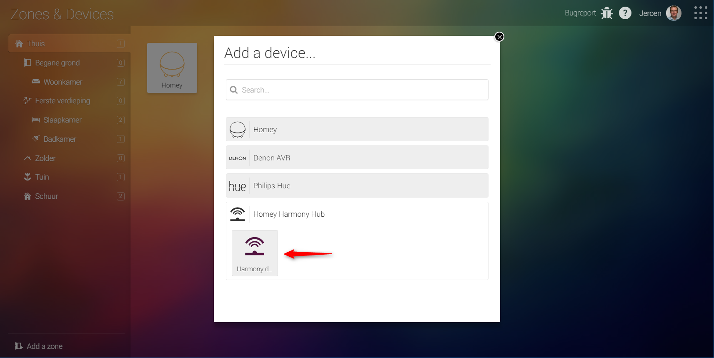
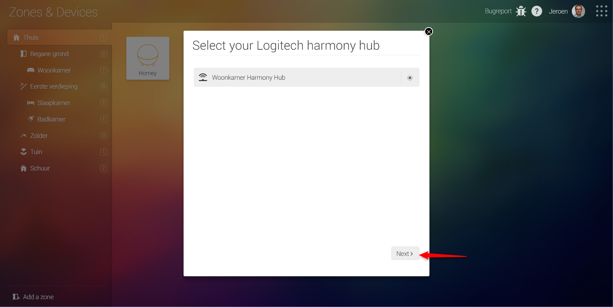
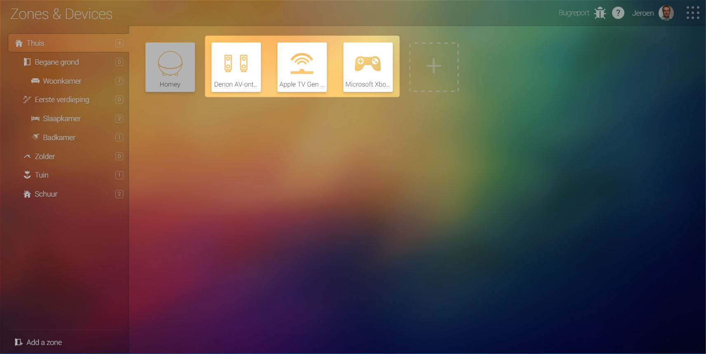
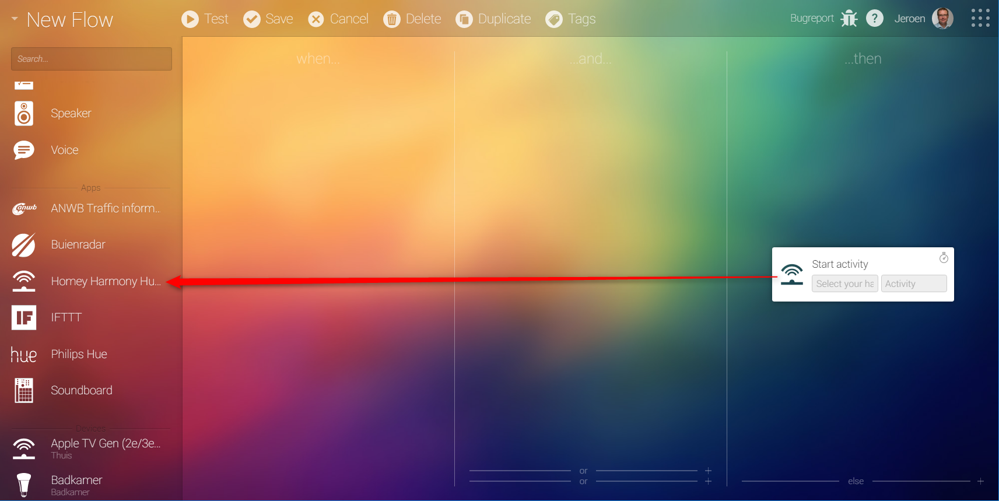
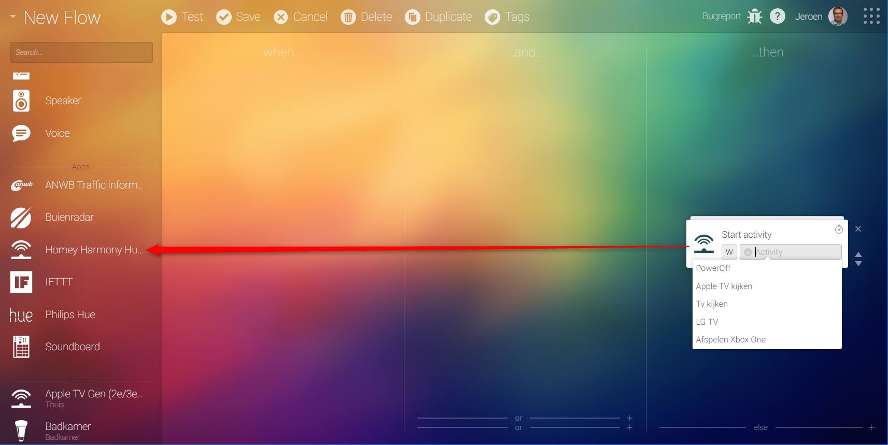
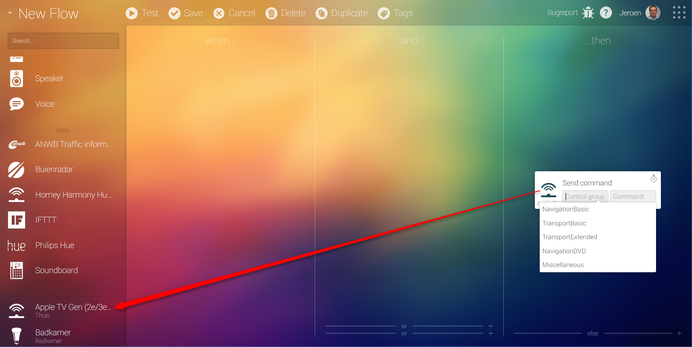

# Homey Harmony Hub App

This project is in early stage of development. At the moment this project supports:
- Pairing of devices connected to the harmony hub
- A mobile card supporting the power toggle functionality of the device
- An action card for sending a specific command to the Harmony device using homey flows.
- Action cards for starting/stopping a hub activity
- Trigger cards for device is turned on/off
- Trigger cards for activity is started/stopped
- Syncing the device onoff state based on the current hub activity

# Donations
If you like the work on this project please consider a donation. Of course, this is optional and you should in no way feel obligated to send a donation. The donations will be spent on buying a second Harmony Hub to support me testing a multi-hub situation.

# Setup

Once the app is installed you can pair a device that is connected to the harmony hub:

### -1- Click on the plus on the homey Zones & Devices screen to add devices

### -2- Select homey harmony hub

### -3- Select the hub you want to start pairing on

### -4- Select all devices you want to pair

### -5- Your devices are now paired

# Setting up triggers

The following triggers are supported by this app:

- Activity started
- Activity stopped
- Device turned on
- Device turned off

## Activity started

To use this trigger drag the Homey Harmony Hub from the apps section to the when column

This trigger exposes 2 tokens hub and activity. The hub token reports the hub name an activity was triggered on. The activity token reports the activity name an activity was triggered on.

## Activity stopped

To use this trigger drag the Homey Harmony Hub from the apps section to the when column

This trigger exposes 2 tokens hub and activity. The hub token reports the hub name an activity was triggered on. The activity token reports the activity name an activity was triggered on.

## Device turned on

To use this triggegr drag the paired device from the devices section to the when column.

This trigger exposes 1 token hub. The hub token reports the hub name an activity was triggered on. 

## Device turned off

To use this triggegr drag the paired device from the devices section to the when column.

This trigger exposes 1 token hub. The hub token reports the hub name an activity was triggered on. 

# Setting up actions

The following actions are supported by this app:
- Start activity
- Stop activity
- Send command to device

## Start activity

To use this action drag the Homey Harmony Hub from the apps section to the then column

Now specify the Harmony Hub on which you want to start your activity 

After you specified the hub you can select the activity you want to start

## Stop activity

To use this action drag the Homey Harmony Hub from the apps section to the then column

Now specify the Harmony Hub on which you want to start your activity 

After you specified the hub you can select the activity you want to start

## Send command to device

To use this triggegr drag the paired device from the devices section to the then column.

Now specify the control group your command is in

After you specified the control group you can select the command you want to send to the selected device

# Future releases

At the moment there is no real roadmap but for the upcoming release you can expect the following:
- Pick an icon you want to use for your device during pairing.
- Command send trigger card.
- ...... create an issue on Github with a Feature request label an who knows your feature will be in the next release!

# Why developing another homey harmony hub driver when there already is one available?

I am aware there is already a [great project](https://github.com/netactivenl/com.logitech.harmony.hub) with a working harmony hub driver. Because I would like to have a different pairing strategy which would be a fundamental difference I decided to start a project of my own.

# What does this app track?

This app uses Application Insights to track the following topics:
- Application errors, which help to solve issues
- Unknown device types, so I can add more icons in future releases, making it easier to find the device you are looking for in the Homey flow editor.

The information gathered is for debugging purposes only at no time will it be used for tracking personal information. 

# Contributing to this project
If you want to be a contributor for this project, you are very welcome! 

# Contact information
If you want to contact me the best way is joining the [athomcommunity](http://athomcommunity.slack.com) on slack and send a direct message to @jreenen.  

# Used external library's

[swissmanu's harmonyhubjs-client](https://github.com/swissmanu/harmonyhubjs-client)

[swissmanu's harmonyhubjs-discover](https://github.com/swissmanu/harmonyhubjs-discover)

